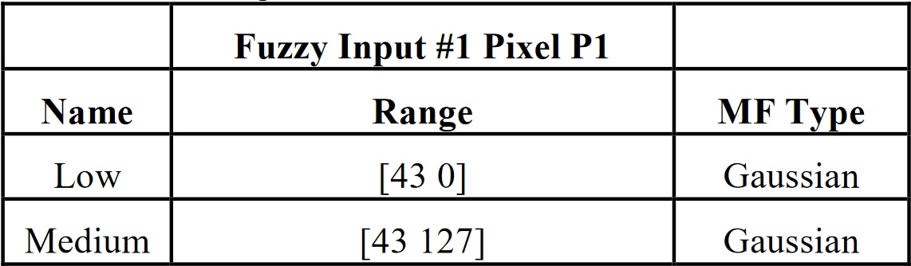
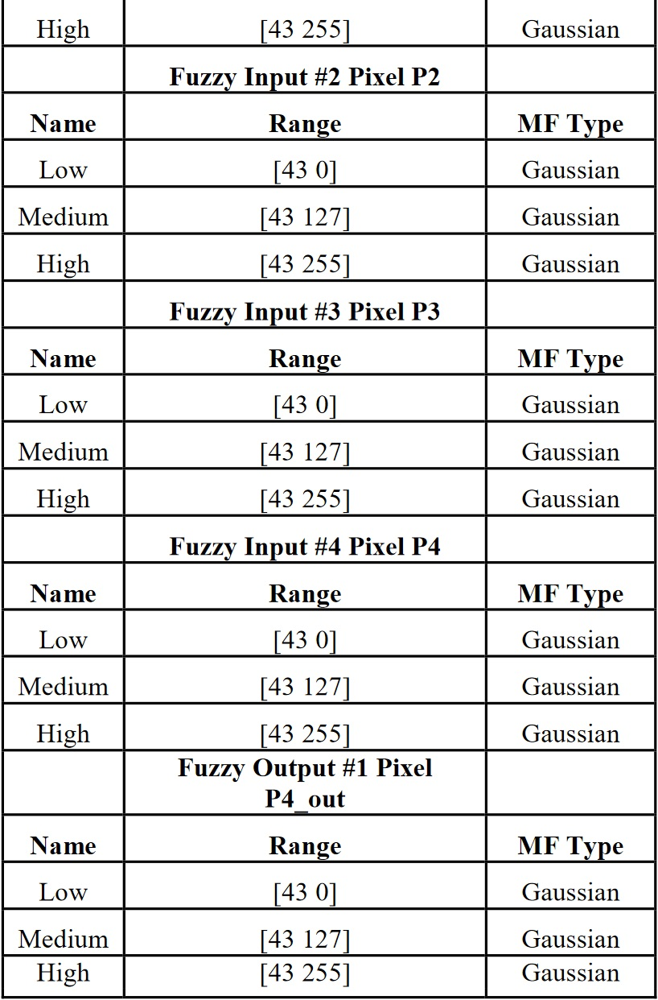
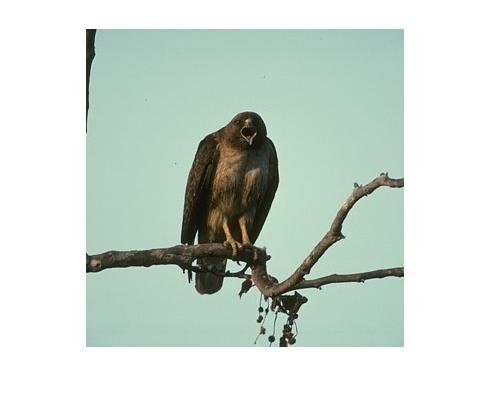
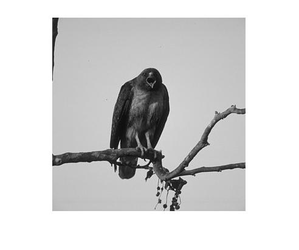
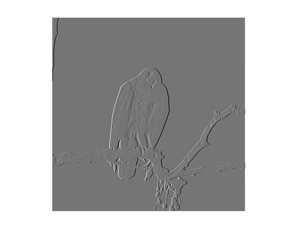
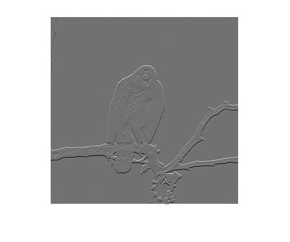
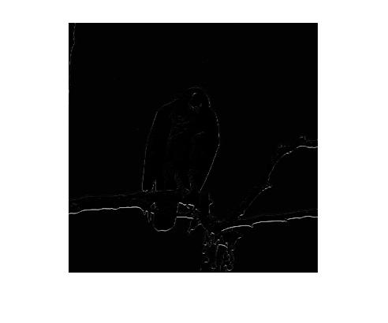

# Detección de bordes usando un sistema de inferencia difuso
El siguiente script de MATLAB tiene por objectivo realizar detección de bordes 
utilizando un sistema de inferencia difuso con el método de mandami y reglas de
inferencia difusa propuestas por [Jaideep Kaur - Poonam Sethi
("An Efficient Method of Edge Detection using Fuzzy
Logic" (2013))](https://research.ijcaonline.org/volume77/number15/pxc3891351.pdf)

## Código fuente y explicación

```
function O=fuzzyedge(name)
% fuzzyedge(imname)
% 
% Proporciona una imagen en escala de grises con bordes detectados
% utilizando un sistema de inferencia difuso propuesto por Jaideep Kaur - 
% Poonam Sethi.
% (https://research.ijcaonline.org/volume77/number15/pxc3891351.pdf)
% 
% Uso
% Toma como entrada el nombre de una imagen RGB que se encuentre en el
% Directorio de trabajo, su salida es una imagen en escala de grises.
% Se debe proporcionar el archivo .fis del sistema de inferencia difuso con
% el nombre ''kaur_sethi.fis'.

    % Se carga el sistema de inferencia difuso
    fis=readfis('kaur_sethi.fis');
    % Lectura de la imagen
    Aog=imread(name);
    % Conversión de la imagen a escala de grises
    A=rgb2gray(Aog);
    [row, column] = size(A);
    A = double(A);

    % SE CREAN LOS GRADIENTES Gx Y Gy
    Gx =[-1 1];
    Gy = Gx(:); %CALCULA LA TRANSPUESTA
    
    % CONVOLUCIONA G con Gx, USANDO LA FUNCION conv2, PARA OBTENER LA MATRIZ
    % QUE CONTIENE LOS GRADIENTES DEL eje x DE I
    Ax = double(uint8(255 * mat2gray(conv2(A,Gx,'same'))));
    % CONVOLUCIONA G con Gy, USANDO LA FUNCION conv2, PARA OBTENER LA MATRIZ QUE
    % CONTIENE LOS GRADIENTES DEL eje y DE I
    Ay = double(uint8(255 * mat2gray(conv2(A,Gy,'same'))));

    % SE CREA UNA MATRIZ QUE MOSTRARA LA IMAGEN DE SALIDA
    Ox = zeros(row,column,"double");
    Oy = zeros(row,column,"double");

    for r=1:row-1
      for c=1:column-1
        % Vector temporal que representa la ventana 2*2 [P1 P2 P3 P4]
        T = [Ax(r,c:c+1) A(r+1,c:c+1)];
        % Se evalua usando el sistema de inferencia y se asigna el
        % resultado al pixel P1 de la matriz de salida.
        Ox(r,c) = evalfis(fis, T);
        % Vector temporal que representa la ventana 2*2 [P1 P2 P3 P4]
        T = [Ay(r,c:c+1) A(r+1,c:c+1)];
        % Se evalua usando el sistema de inferencia y se asigna el
        % resultado al pixel P1 de la matriz de salida.
        Oy(r,c) = evalfis(fis, T);
      end
    end
    
    O = abs(Oy - Ox);
    O = uint8(O);
    figure;
    imshow(Aog);
    figure;
    imshow(uint8(A));
    figure;
    imshow(uint8(Ax));
    figure;
    imshow(uint8(Ay));
    figure;
    imshow(O);
end
```
### Explicación

La función `fuzzyedge` toma como parámetro el nombre de imgen envuelta en
comillas simples y retorna una matriz del mismo tamaño.

Primeramente se carga la imagen con la función `imread` y esta es pasada a
escala de grises con la función `rgb2gray`. También se carga el sistema de
inferencia difuso, luego se calcula las gradiantes en ambos ejes y se aplica a
la imagen en ventanas de 2*2. Es decir posee 4 entradas y una salida,
y el sistema posee las siguiente propiedades:

#### Funciones de memebresías





#### Reglas de inferencia

```
1. Si  P1  es  Bajo  and  P2  es  Bajo  then  P4_out  es Bajo.
2. Si P1 es Medio and P2 es Medio then P4_out es Alto.
3. Si  P1  es  Alto  and  P2  es  Alto  then  P4_out  es Alto.
4. Si P1 es Medio and P3 es Bajo then P4_out es Alto.
5. Si P2 es Medio and P3 es Bajo then P4_out es Alto.
6. Si P4 es Bajo and P2 es Medio then P4_out es Bajo.
7. Si P4 es Bajo and P1 es Medio then P4_out es Bajo. 
```

## Uso
Para poder utilizar el código, puede utilizar
[MATLAB](https://la.mathworks.com/products/matlab.html) u otra alternativa como
[Octave](https://www.gnu.org/software/octave/index). En ambos debe contar con
sus respectivos paquetes de Lógica difusa (
  [Octave](https://octave.sourceforge.io/fuzzy-logic-toolkit/index.html) |
[MATLAB](https://la.mathworks.com/products/fuzzy-logic.html) )
y de manejo de imágenes (
  [Octave](https://octave.sourceforge.io/image/index.html) |
[MATLAB](https://www.mathworks.com/products/image.html) )

Luego puede llamar a la función desde cualquier script (siempre incluyendo el
archivo `fuzzyedge.m` y `kaur_sethi.fis` en el directorio de trabajo) de la
siguiente manera:
```
FI = fuzzyedge('image.jpg');
```

## Ejemplos
Entrada:



Imagen en escalas de grises:



Gradiente en X:



Gradiente en Y:



Salida luego de aplicar el sistema de inferencia difuso:

